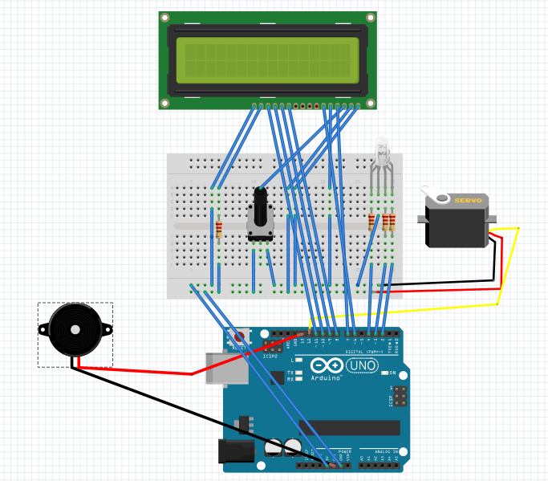

## GayBox ?
GayBox is a prototype of connected object made during a two days workshop with [Atelier Objets Connectés](http://www.atelier-objets-connectes.org/) in Lyon, May 23-24 2015.
It was an excuse for us, with no experience in Internet of Things, to try a few basic technologies.

We ended with a box reacting in various ways at the appearance of #gay on twitter.
The box is build around a arduino board connected to a laptop running a python script checking twitter, through serial port.
The arduino board pilots rgb leds, a speaker, a lcd screen and a servo motor

[Short video of the object](blob:https%3A//vine.co/4648c934-ad65-4e07-b2b8-080d61e42ebe)

## Hardware

### Material
- 1 arduino uno
- 1 servo motor
- 1 lcd screen
- 1 speaker
- 2 rgb leds
- 1 potentiometer
- 4 220 ohm resistors
- 1 freddy mercury in paper

### Schema

## Software
 A python script on a ubuntu laptop.

### Launch project

- 1. upload GayBoxOutput.ino on your arduino (pitches.h should come with)
- 2. connect your arduino board through serial
- 3. Check the python script references the serial port on which respond your board
- 4. Launch the python script : `$ sudo python GayBoxTweetReceiver.py`

